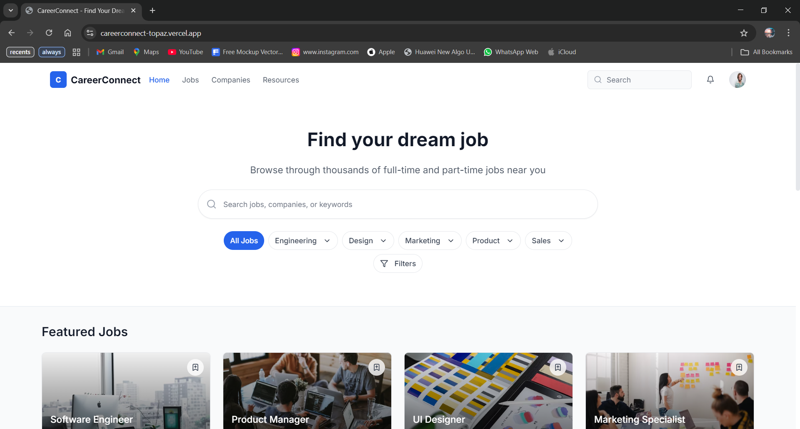

# CareerConnect - Job Board Platform

CareerConnect is a modern job board platform built with Next.js, TypeScript, and Tailwind CSS. It provides a seamless experience for job seekers to discover and apply for opportunities across various industries.



## 🌟 Features

- **Advanced Job Search**: Search jobs by title, company, or skills with real-time suggestions
- **Smart Filtering**: Filter jobs by experience level, salary range, and work arrangement
- **Responsive Design**: Fully responsive interface that works seamlessly across all devices
- **Modern UI**: Clean and intuitive interface built with shadcn/ui components
- **Real-time Updates**: Instant search results with debounced queries
- **Category Navigation**: Easy browsing through job categories
- **Featured Jobs**: Highlighted premium job listings
- **Detailed Job Views**: Comprehensive job details with company information

## 🚀 Live Demo

Check out the live demo: [CareerConnect Demo]
(https://careerconnect-topaz.vercel.app/)


## 🎨 Design

View the Figma design: [CareerConnect Design]
https://www.figma.com/design/hXKfhsBTXYA9c1Q3iM0KP1/CareerConnect?node-id=0-1&p=f&t=qxwFVmgDuUTHlkr3-0

## 🛠️ Tech Stack

- **Framework**: Next.js 15
- **Language**: TypeScript
- **Styling**: Tailwind CSS
- **UI Components**: shadcn/ui
- **Animations**: Framer Motion
- **State Management**: React Hooks
- **Form Handling**: React Hook Form
- **Deployment**: Vercel

## 📦 Installation

1. Clone the repository:
```bash
git clone https://github.com/isaacobenzy/careerconnect.git

2. Navigate to the project directory:
```bash
cd careerconnect
 ```

3. Install dependencies:
```bash
npm install
 ```

4. Run the development server:
```bash
npm run dev
 ```

5. Open http://localhost:3000 in your browser.

## Project Structure
```plaintext
careerconnect/
├── app/                   # Next.js app directory
├── components/           # React components
├── lib/                  # Utility functions and data
├── public/              # Static assets
├── styles/              # Global styles
├── types/               # TypeScript types
└── hooks/               # Custom React hooks
 ```
```

## 🤝 Contributing
1. Fork the repository
2. Create a new branch
3. Make your changes
4. Submit a pull request
## 📄 License
This project is licensed under the MIT License - see the LICENSE file for details.

## 👥 Authors
- Your Name - Isaac Obeng
## 🙏 Acknowledgments
- shadcn/ui for the beautiful UI components
- Vercel for hosting
- Next.js team for the amazing framework
## 📞 Contact
For any questions or feedback, please reach out to:

- Email: obengebenezer01@gmail.com
- Phone : +233245908421

